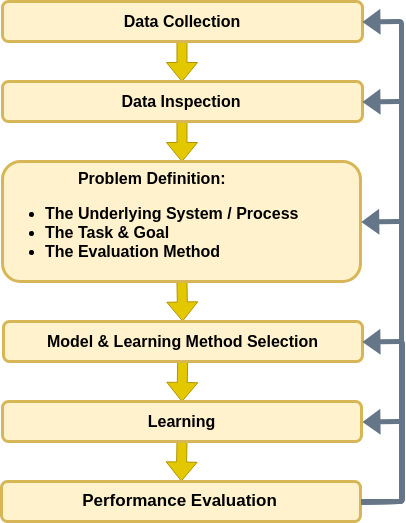

<!-- .slide: class="center" -->

<h1 style="font-family:'KG Second Chances Sketch';font-size:100px;line-height:2;color:white;font-weight:normal;">Workshop 1<br>Introduction</h1>

---new slide---

##  Goals

<br>

- **Primary goal**: Improve the understanding and intuition.

- **Secondary goal**: Provide tools for approaching and solving real problems.

<br>

- Relation to Homework Assignment

- A comment about the code

---new slide---

##  This Workshop

<br>

In this workshop, we will mainly be discussing the process which we will be using for solving the problem.

---new slide---

## Why Python?

<br>

- It is currently one of the most popular programming languages.

- New frameworks are developed for python: PyTorch, TensorFlow, Keras, etc.

- It is a very powerful programing language and yet very simple to learn.

- It's open-source.

- It has a ridiculously rich set of packages for almost any task.

---new slide---

##  Jumping Into The Water  

<br>

- We will start by applying a simple solution to a popular introductory problem.
- We will do it in a very sloppy way.
- The solution we will get will be very far from idle.
- The goal here is only to build the overall idea the general process.

---new slide---

##  <font size="8">The Titanic Prediction Problem</font>

<br>

Objective:

*Predict whether or not a given passenger has survived the Titanic tragedy based only the passengers' details. Based on a portion of the passenger manifest along with the data of whether or not these passengers have survived.*

---new slide---

##  <font size="8">The Titanic - Cont.</font>

<br>

Some reasons for why we might be able guess based on these cold facts are:

1. Mid-age people might be better swimmers then very young or old people.
2. The different classes on board the Titanic were located in different areas of the boat.
3. It might be that most of the people gave the women priority when boarding the lifeboats.
4. etc.

---new slide---

##  The workflow

<center></center>

---new slide---

## Applying the Workflow

<br>

We will start by importing some useful packages


```python
## Importing packages
import numpy as np  # Numerical package (mainly multi-dimensional arrays and linear algebra)
import pandas as pd  # A package for working with data frames
import matplotlib.pyplot as plt  # A plotting package

%matplotlib inline

## A function to add Latex (equations) to output which works also in Google Colabrtroy
## In a regular notebook this could simply be replaced with "display(Markdown(x))"
from IPython.display import HTML
def print_math(x):  # Define a function to preview markdown outputs as HTML using mathjax
    display(HTML(''.join(['<p><script type="text/x-mathjax-config">MathJax.Hub.Config({tex2jax: {inlineMath: [[\'$\',\'$\'], [\'\\\\(\',\'\\\\)\']]}});</script><script src=\'https://cdnjs.cloudflare.com/ajax/libs/mathjax/2.7.3/latest.js?config=TeX-AMS_CHTML\'></script>',x,'</p>'])))
```

---new slide---

##  Data collection

<br>

- We will only work with pre-collected datasets.
- It is an integral part of the process.
- We won't discuss this step at all.

---new slide---

##  Data Inspection

<br>

We will start by loading the data and taking a look at it by printing out the 10 first rows.

```python
data_file = 'https://technion046195.github.io/semester_2019_spring/datasets/titanic_manifest.csv'

## Loading the data
dataset = pd.read_csv(data_file)

## Print the number of rows in the data set
number_of_rows = len(dataset)
print('Number of rows in the dataset: {}'.format(number_of_rows))

## Show the first 10 rows
dataset.head(10)

```

---new slide---

<div>
<table border="1" class="dataframe">
  <thead>
    <tr style="text-align: right;">
      <th></th>
      <th>pclass</th>
      <th>survived</th>
      <th>name</th>
      <th>sex</th>
      <th>age</th>
      <th>sibsp</th>
      <th>parch</th>
      <th>ticket</th>
      <th>fare</th>
      <th>cabin</th>
      <th>embarked</th>
      <th>boat</th>
      <th>body</th>
      <th>home.dest</th>
      <th>numeric_sex</th>
    </tr>
  </thead>
  <tbody>
    <tr>
      <th>0</th>
      <td>1</td>
      <td>1</td>
      <td>Allen, Miss. Elisabeth Walton</td>
      <td>female</td>
      <td>29</td>
      <td>0</td>
      <td>0</td>
      <td>24160</td>
      <td>211.3375</td>
      <td>B5</td>
      <td>S</td>
      <td>2</td>
      <td>NaN</td>
      <td>St Louis, MO</td>
      <td>1</td>
    </tr>
    <tr>
      <th>1</th>
      <td>1</td>
      <td>0</td>
      <td>Allison, Miss. Helen Loraine</td>
      <td>female</td>
      <td>2</td>
      <td>1</td>
      <td>2</td>
      <td>113781</td>
      <td>151.5500</td>
      <td>C22 C26</td>
      <td>S</td>
      <td>NaN</td>
      <td>NaN</td>
      <td>Montreal, PQ / Chesterville, ON</td>
      <td>1</td>
    </tr>
    <tr>
      <th>2</th>
      <td>1</td>
      <td>0</td>
      <td>Allison, Mr. Hudson Joshua Creighton</td>
      <td>male</td>
      <td>30</td>
      <td>1</td>
      <td>2</td>
      <td>113781</td>
      <td>151.5500</td>
      <td>C22 C26</td>
      <td>S</td>
      <td>NaN</td>
      <td>135.0</td>
      <td>Montreal, PQ / Chesterville, ON</td>
      <td>0</td>
    </tr>
    <tr>
      <th>3</th>
      <td>1</td>
      <td>0</td>
      <td>Allison, Mrs. Hudson J C (Bessie Waldo Daniels)</td>
      <td>female</td>
      <td>25</td>
      <td>1</td>
      <td>2</td>
      <td>113781</td>
      <td>151.5500</td>
      <td>C22 C26</td>
      <td>S</td>
      <td>NaN</td>
      <td>NaN</td>
      <td>Montreal, PQ / Chesterville, ON</td>
      <td>1</td>
    </tr>
    <tr>
      <th>4</th>
      <td>1</td>
      <td>1</td>
      <td>Anderson, Mr. Harry</td>
      <td>male</td>
      <td>48</td>
      <td>0</td>
      <td>0</td>
      <td>19952</td>
      <td>26.5500</td>
      <td>E12</td>
      <td>S</td>
      <td>3</td>
      <td>NaN</td>
      <td>New York, NY</td>
      <td>0</td>
    </tr>
    <tr>
      <th>5</th>
      <td>1</td>
      <td>1</td>
      <td>Andrews, Miss. Kornelia Theodosia</td>
      <td>female</td>
      <td>63</td>
      <td>1</td>
      <td>0</td>
      <td>13502</td>
      <td>77.9583</td>
      <td>D7</td>
      <td>S</td>
      <td>10</td>
      <td>NaN</td>
      <td>Hudson, NY</td>
      <td>1</td>
    </tr>
    <tr>
      <th>6</th>
      <td>1</td>
      <td>0</td>
      <td>Andrews, Mr. Thomas Jr</td>
      <td>male</td>
      <td>39</td>
      <td>0</td>
      <td>0</td>
      <td>112050</td>
      <td>0.0000</td>
      <td>A36</td>
      <td>S</td>
      <td>NaN</td>
      <td>NaN</td>
      <td>Belfast, NI</td>
      <td>0</td>
    </tr>
    <tr>
      <th>7</th>
      <td>1</td>
      <td>1</td>
      <td>Appleton, Mrs. Edward Dale (Charlotte Lamson)</td>
      <td>female</td>
      <td>53</td>
      <td>2</td>
      <td>0</td>
      <td>11769</td>
      <td>51.4792</td>
      <td>C101</td>
      <td>S</td>
      <td>D</td>
      <td>NaN</td>
      <td>Bayside, Queens, NY</td>
      <td>1</td>
    </tr>
    <tr>
      <th>8</th>
      <td>1</td>
      <td>0</td>
      <td>Artagaveytia, Mr. Ramon</td>
      <td>male</td>
      <td>71</td>
      <td>0</td>
      <td>0</td>
      <td>PC 17609</td>
      <td>49.5042</td>
      <td>NaN</td>
      <td>C</td>
      <td>NaN</td>
      <td>22.0</td>
      <td>Montevideo, Uruguay</td>
      <td>0</td>
    </tr>
    <tr>
      <th>9</th>
      <td>1</td>
      <td>0</td>
      <td>Astor, Col. John Jacob</td>
      <td>male</td>
      <td>47</td>
      <td>1</td>
      <td>0</td>
      <td>PC 17757</td>
      <td>227.5250</td>
      <td>C62 C64</td>
      <td>C</td>
      <td>NaN</td>
      <td>124.0</td>
      <td>New York, NY</td>
      <td>0</td>
    </tr>
  </tbody>
</table>
</div>

Number of rows in the dataset: 1001

---new slide---

### The Data Types

<br>

<div>
<table border="1" class="dataframe">
  <thead>
    <tr style="text-align: right;">
      <th></th>
      <th>pclass</th>
      <th>survived</th>
      <th>name</th>
      <th>sex</th>
      <th>age</th>
      <th>sibsp</th>
      <th>parch</th>
      <th>ticket</th>
      <th>fare</th>
      <th>cabin</th>
      <th>embarked</th>
      <th>boat</th>
      <th>body</th>
      <th>home.dest</th>
      <th>numeric_sex</th>
    </tr>
  </thead>
  <tbody>
    <tr>
      <th>0</th>
      <td>1</td>
      <td>1</td>
      <td>Allen, Miss. Elisabeth Walton</td>
      <td>female</td>
      <td>29</td>
      <td>0</td>
      <td>0</td>
      <td>24160</td>
      <td>211.3375</td>
      <td>B5</td>
      <td>S</td>
      <td>2</td>
      <td>NaN</td>
      <td>St Louis, MO</td>
      <td>1</td>
    </tr>
  </tbody>
</table>
</div>

<br>

- **numerical_sex**: 0 - male, 1 - female (a boolean).
- **pclass**: 1st, 2nd or 3rd (a class indicator).
- **survived**: passenger has survived (a boolean)

---new slide---

##  Problem Definition

### The Underlying Process

- Back box which randomly spits out pairs of passenger parameters and a survival indicator
- Outcomes are statistically independent.

<center></center>

---new slide---

### The Task and the Goal

<br>

A function which maps from the input space of gender and class, `$ \boldsymbol{x} $`, into the binary space of the survival indicator, `$y$`:

`$$
\hat{y}=h\left(\boldsymbol{x}\right)
$$`

<br>

*A binary classification problems*.

---new slide---

### Evaluation Method

<br>

- A way to evaluate different functions.

- **The risk function**: A numeric score of how **bad** a prediction function performs.

---new slide---

### The Misclassification Rate

<br>

- `$N$` - the number of sample in the dataset.
- `$\boldsymbol{x}_i=\left(\text{gender},\text{class}\right)$` - the `$i$`'s person parameters.
- `$I\left\{\text{condition}\right\}$` - an indicator function.

<br>

`$$
R\left\{h, \left\{\boldsymbol{x},y\right\}\right\}=\frac{1}{N}\sum_i I\left\{h\left(\boldsymbol{x}_i\right)\neq y_i\right\}
$$`

---new slide---

### Splitting the dataset

A problem: We are using the same data for both:

- Producing the prediction function.
- Evaluating the performance.

<br>

Solution: split the dataset.

A common practice is to use an 80% train-20% test split

---new slide---

```python
## Preparing the data set
## Constructing x_{i,j} and y_i. Here i runs over the passengers and j runs over [gender, class]
x = dataset[['numeric_sex', 'pclass']]
y = dataset['survived']

n_samples = len(x)

## Generate a random generator with a fixed seed (this is important to make our result reproducible)
rand_gen = np.random.RandomState(0)

## Generating a vector of indices
indices = np.arange(n_samples)

## Shuffle the indices
rand_gen.shuffle(indices)
```

---new slide---

```python
## Split the indices into 80% train / 20% test
n_samples_train = int(n_samples * 0.8)
n_samples_test = n_samples - n_samples_train
train_indices = indices[:n_samples_train]
test_indices = indices[n_samples_train:]

## Split the data
x_train = x.iloc[train_indices]
x_test = x.iloc[test_indices]
y_train = y.iloc[train_indices]
y_test = y.iloc[test_indices]

## We could have directly shuffled and split the data, but in this way, we are still left with the original data and the indices which were used for the split which could be useful, especially for debugging. 
```

---new slide---

##  Model suggestion

<br>

Considerations for selecting the model:
1. An efficient method for finding the best configuration.
2. Cover an extensive range of solutions.
3. A range of solution which is too wide will cause overfitting.

---new slide---

##  Model Suggestion - Cont.

The most general prediction function:

`$$
h_\boldsymbol{\theta}\left(\boldsymbol{x}\right)=\left\{
\begin{array}{ll}
      \theta_{0, 1} & \boldsymbol{x}=\left(0, 1\right) \\
      \theta_{0, 2} & \boldsymbol{x}=\left(0, 2\right) \\
      \theta_{0, 3} & \boldsymbol{x}=\left(0, 3\right) \\
      \theta_{1, 1} & \boldsymbol{x}=\left(1, 1\right) \\
      \theta_{1, 2} & \boldsymbol{x}=\left(1, 2\right) \\
      \theta_{1, 3} & \boldsymbol{x}=\left(1, 3\right) \\
\end{array}
\right.
$$`

**reminder**: `$\boldsymbol{x}=\left(\text{gender}, \text{class}\right)$`

---new slide---

##  Model Suggestion - Cont.

Or viewed as a table:

<br>

| Sex \ Class |  1st class      | 2nd Class      | 3rd class      |
| ----------- | --------------- | -------------- | -------------- |
| Male (0)    |  $\theta_{0,1}$ | $\theta_{0,2}$ | $\theta_{0,3}$ |
| Female (1)  |  $\theta_{1,1}$ | $\theta_{1,2}$ | $\theta_{1,3}$ |

---new slide---

##  Model Suggestion - Cont.

Our first attempt: a constant prediction function:

<br>

`$$
h_\theta\left(\boldsymbol{x}\right)=\theta
$$`

<br>

| Sex \ Class |  1st class  | 2nd Class  | 3rd class  |
| ----------- | ----------- | ---------- | ---------- |
| Male (0)    |  $\theta$   | $\theta$   | $\theta$   |
| Female (1)  |  $\theta$   | $\theta$   | $\theta$   |


---new slide---

##  Learning Method Suggestion

there are only 2 configurations for this model:
- `$h_{\theta=0}\left(\boldsymbol{x}\right)=0$`
- `$h_{\theta=1}\left(\boldsymbol{x}\right)=1$`

<br>

Therefore, our learning method would be to simply check them both. (brute force)

---new slide---

##  Learning

<br>

We would like to find `$\theta^*$` such that:

<br>

`$$
\begin{align*}
\theta^*
& = \underset{\theta}{\arg\min}\  R\left\{h_{\theta}, \left\{\boldsymbol{x} ,y\right\}\right\} \\
& = \underset{\theta}{\arg\min}\  \frac{1}{N}\sum_i I\left\{\theta\neq y_i\right\}
\end{align*}
$$`

---new slide---

##  Learning

```python
## Loop over the two possible theta
print('The train risk for each predictor is:')
for theta in [0, 1]:
    ## The number of worng prediction for theta:
    predictions = theta
    train_risk = (y_train.values != predictions).mean()
    print_math('- $R_\\text{{train}}\\{{ h_{{ \\theta={} }} \\}}={:.2}$'.format(theta, train_risk))
```

<br>

#### Output

- `$R_\text{train}\{ h_{ \theta=0 } \}=0.42$`
- `$R_\text{train}\{ h_{ \theta=1 } \}=0.58$`

---new slide---

##  Performance evaluation

<br>

Our proposed prediction function would be:

`$$
h\left(\boldsymbol{x}\right)=0\quad\forall\boldsymbol{x}
$$`

<br>

Let us evaluate the risk on the test set.

---new slide---

##  Performance evaluation

```python
## The evaluation of the final risk
predictions = 0
test_risk = (y_test.values != predictions).mean()
print_math('The test risk is: $R_\\text{{test}}\\{{ h_{{ \\theta=0 }} \\}}={:.2}$'.format(test_risk))
```

<br>

#### Output

`$R_\text{test}\{ h_{ \theta=0 } \}=0.4$`

---new slide---

##  Model suggestion - 2nd Attempt

- The general model with `$2^6$` possible combinations.

<br>

| Sex \ Class |  1st class      | 2nd Class      | 3rd class      |
| ----------- | --------------- | -------------- | -------------- |
| Male (0)    |  $\theta_{0,1}$ | $\theta_{0,2}$ | $\theta_{0,3}$ |
| Female (1)  |  $\theta_{1,1}$ | $\theta_{1,2}$ | $\theta_{1,3}$ |

<br>

- We can select each `$\theta_{m,n}$` individually.

---new slide---

##  Learning

<br>

We would like to find `$\theta_{m,n}^*$` such that:

<br>

`$$
\begin{align*}
\theta_{m,n}^*
& = \underset{\theta_{m,n}\in\left\{0,1\right\}}{\arg\min}\  R\left\{h_{\boldsymbol{\theta}}, \left\{\boldsymbol{x}_i ,y_i:\boldsymbol{x}_i=\left(m,n\right)\right\}\right\} \\
& = \underset{\theta_{m,n}\in\left\{0,1\right\}}{\arg\min}\ \frac{1}{N_{m,n}}\sum_{i,\boldsymbol{x}_i=\left(m,n\right)} I\left\{\theta_{m,n}\neq y_i\right\}
\end{align*}
$$`

---new slide---

##  Learning

```python
print('The train risk for each group is:')
## loop over the gender
for gender in [0, 1]:
    ## loop over the class
    for class_ in [1, 2, 3]:  # we have used "class_" since the word "class" is already in use by python
        print('')  # An empty line
        print_math('## For $\\{{\\boldsymbol{{x}}_i,y_i:\\boldsymbol{{x}}_i=({},{}) \\}}$'.format(gender, class_))
        ## Loop over the two possible theta
        for theta in [0, 1]:
            ## The number of worng prediction for theta:
            predictions = theta
            indices = (x_train['numeric_sex'].values == gender) & (x_train['pclass'].values == class_)
            train_risk = (y_train.values[indices] != predictions).mean()
            print_math('-- $\\theta_{{ {},{} }}={} \Rightarrow R_{{\\text{{train}}}}\\{{h_{{ \\boldsymbol{{\\theta}} }}\\}}={:.2f}$'.format(gender, class_, theta, train_risk))
```

<br>

#### Output

(In the next two slides)

---new slide---

For `$\boldsymbol{x}_i=(0,1)$`
- `$\theta_{ 0,1 }=0 \Rightarrow R_{\text{train}}\{h_{ \boldsymbol{\theta} }\}=0.39$`
- `$\theta_{ 0,1 }=1 \Rightarrow R_{\text{train}}\{h_{ \boldsymbol{\theta} }\}=0.61$`

<br>

For `$\boldsymbol{x}_i=(0,2)$`
- `$\theta_{ 0,2 }=0 \Rightarrow R_{\text{train}}\{h_{ \boldsymbol{\theta} }\}=0.12$`
- `$\theta_{ 0,2 }=1 \Rightarrow R_{\text{train}}\{h_{ \boldsymbol{\theta} }\}=0.88$`

<br>

For `$\boldsymbol{x}_i=(0,3)$`
- `$\theta_{ 0,3 }=0 \Rightarrow R_{\text{train}}\{h_{ \boldsymbol{\theta} }\}=0.17$`
- `$\theta_{ 0,3 }=1 \Rightarrow R_{\text{train}}\{h_{ \boldsymbol{\theta} }\}=0.83$`

---new slide---

For `$\boldsymbol{x}_i=(1,1)$`
- `$\theta_{ 1,1 }=0 \Rightarrow R_{\text{train}}\{h_{ \boldsymbol{\theta} }\}=0.97$`
- `$\theta_{ 1,1 }=1 \Rightarrow R_{\text{train}}\{h_{ \boldsymbol{\theta} }\}=0.03$`

<br>

For `$\boldsymbol{x}_i=(1,2)$`
- `$\theta_{ 1,2 }=0 \Rightarrow R_{\text{train}}\{h_{ \boldsymbol{\theta} }\}=0.90$`
- `$\theta_{ 1,2 }=1 \Rightarrow R_{\text{train}}\{h_{ \boldsymbol{\theta} }\}=0.10$`

<br>

For `$\boldsymbol{x}_i=(1,3)$`
- `$\theta_{ 1,3 }=0 \Rightarrow R_{\text{train}}\{h_{ \boldsymbol{\theta} }\}=0.47$`
- `$\theta_{ 1,3 }=1 \Rightarrow R_{\text{train}}\{h_{ \boldsymbol{\theta} }\}=0.53$`

---new slide---

##  Learning

Our optimal predictor would be:

<br>

| Sex \ Class |  1st class  | 2nd Class  | 3rd class  |
| ----------- | ----------- | ---------- | ---------- |
| Male (0)    | 0           | 0          | 0          |
| Female (1)  | 1           | 1          | 0          |

---new slide---

##  Performance evaluation

```python
## The optimal predictor

## We will define a prediction function which recives a row in the 
## dataset as an input and outputs a predition
def row_predictor(row):
    gender = row['numeric_sex']
    class_ = row['pclass']

    prediction_map = {
        (0, 1): 0,
        (0, 2): 0,
        (0, 3): 0,
        (1, 1): 1,
        (1, 2): 1,
        (1, 3): 0,
    }

    prediction = prediction_map[(gender, class_)]
    return prediction
```

---new slide---

##  Performance evaluation

```python
## Apllying the predicion function to every line in the table
predictions = x_test.apply(row_predictor, axis='columns')

## The evaluation of the final risk
test_risk = (y_test.values != predictions).mean()
print_math('The test risk is: $R_\\text{{test}}\\{{ h_{{ \\boldsymbol{{\\theta}}^* }} \\}}={:.2f}$'.format(test_risk))
```

<br>

#### Output

`$R_\text{test}\{ h_{ \boldsymbol{\theta}^* } \}=0.23$`

---new slide---

##  Conclusion

<center></center>