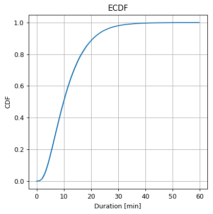
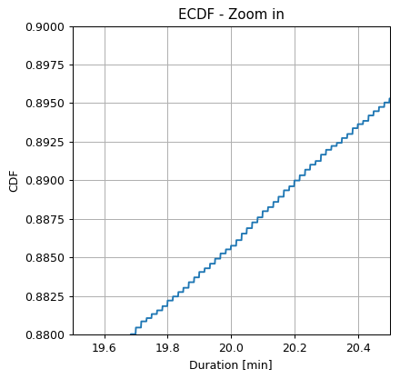
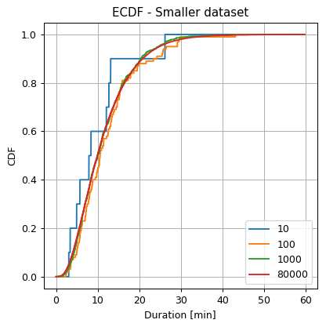
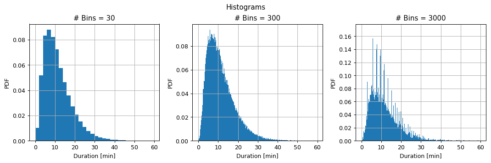
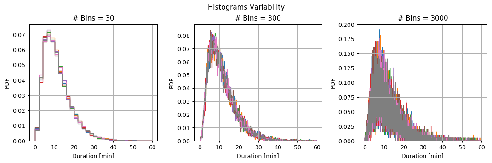
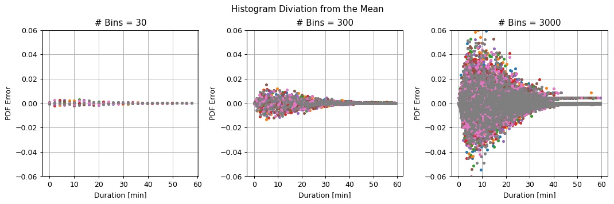
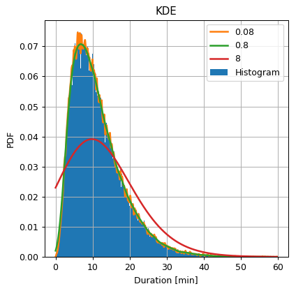
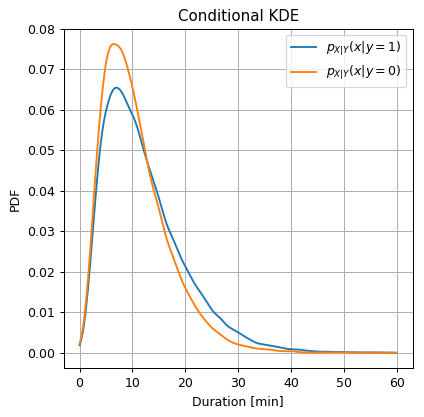
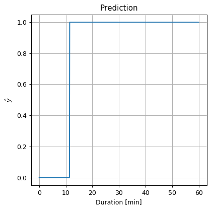

<!-- .slide: class="center" -->

<h1 class="workshop-title">Workshop 2<br>Non-Parametric Density Estimation</h1>

---new slide---

##  A Random Phenomenon

<br>
<br>

We take a glass full of juice and pour it on the floor (don't try this at home) and look at the shape of the resulting spill. 

---new slide---

##  A Random Phenomenon - Sample

<br>
<br>
<center>

</center>

---new slide---

##  A Random Phenomenon - Sample Space

<center>

</center>

---new slide---

##  A Random Phenomenon - Random Var.

<center><div style="display:inline-block;background-color:rgba(255, 255, 255, 0.7); box-shadow: 0 0 5px 10px rgba(255, 255, 255, 0.7)">

</div></center>

---new slide---

##  A Random Phenomenon - Event

<center><div style="display:inline-block;background-color:rgba(255, 255, 255, 0.7); box-shadow: 0 0 5px 10px rgba(255, 255, 255, 0.7)">

</div></center>

---new slide---

##  A Random Phenomenon - Event Space

<center><div style="display:inline-block;background-color:rgba(255, 255, 255, 0.7); box-shadow: 0 0 5px 10px rgba(255, 255, 255, 0.7)">

</div></center>

---new slide---

##  A Random Phenomenon - Probability

<center><div style="display:inline-block;background-color:rgba(255, 255, 255, 0.7); box-shadow: 0 0 5px 10px rgba(255, 255, 255, 0.7)">

</div></center>

---new slide---

##  Empirical Measure

Estimation of a probability measure given a set of samples

- `$N$` - the number of samples in the dataset.
- `$\omega_i$` - the $i$-th sample.
- `$I\left\{\omega_i \in A\right\}$` - An indicator function of whether or not `$\omega_i$` is an element in event `$A$`.

The empirical measure of `$P\left(A\right)$` is:

`$$
\hat{p}_A=\tfrac{1}{N}\sum_{i=1}^N I\left\{\omega_i\in A\right\}
$$`

---new slide---

##  Empirical Mean

Estimation of an expectation value given a set of samples

- `$x_i$` - the realization value of the $i$-th sample, i.e., '$X\left(\omega_i\right)$'.

The empirical mean of `$\mathbb{E}\left[f\left(x\right)\right]$` is:

`$$
\hat{\mu}_{f\left(x\right)}=\tfrac{1}{N}\sum_{i=1}^N f\left(x_i\right)
$$`

---new slide---

##  The Empirical CDF (the ECDF)

Estimation of the CDF of a random variable `$X$`.

- `$N$` - the number of samples in the dataset.
- `$x_i$` - the $X$ value of the $i$-th sample.
- `$I\left\{x_i \leq x\right\}$` - An indicator function of whether or not `$x_i$` is smaller then `$x$`.

The empirical CDF of `$X$` is:

`$$
\hat{F}_{X}\left(x\right)=\tfrac{1}{N}\sum_{i=1}^N I\left\{x_i \leq x\right\}
$$`

---new slide---

##  The NYC Taxi Dataset

- The full list of all taxi rides around NYC in every month.

- We will be using the dataset from January 2016,

- Over 10M taxi rides. We will be using a smaller subset with only 100k rides.

<br>

###  Problem: Estimating the Distribution of Trip Duration

- A taxi driver would like to give an estimation for the distributions of trip durations.

- Use historical rides data to estimate this distribution.

---new slide---

##  The Workflow

**Evaluation**: is an important, but it is outside the scope of this course.

<center></center>

---new slide---

##   Data Inspection

<div>
<table border="1" class="dataframe">
  <thead>
    <tr style="text-align: right;">
      <th></th>
      <th>passenger_count</th>
      <th>trip_distance</th>
      <th>payment_type</th>
      <th>fare_amount</th>
      <th>tip_amount</th>
      <th>pickup_easting</th>
      <th>pickup_northing</th>
      <th>dropoff_easting</th>
      <th>dropoff_northing</th>
      <th>duration</th>
      <th>day_of_week</th>
      <th>day_of_month</th>
      <th>time_of_day</th>
    </tr>
  </thead>
  <tbody>
    <tr>
      <th>0</th>
      <td>2</td>
      <td>2.768065</td>
      <td>2</td>
      <td>9.5</td>
      <td>0.00</td>
      <td>586.996941</td>
      <td>4512.979705</td>
      <td>588.155118</td>
      <td>4515.180889</td>
      <td>11.516667</td>
      <td>3</td>
      <td>13</td>
      <td>12.801944</td>
    </tr>
    <tr>
      <th>1</th>
      <td>1</td>
      <td>3.218680</td>
      <td>2</td>
      <td>10.0</td>
      <td>0.00</td>
      <td>587.151523</td>
      <td>4512.923924</td>
      <td>584.850489</td>
      <td>4512.632082</td>
      <td>12.666667</td>
      <td>6</td>
      <td>16</td>
      <td>20.961389</td>
    </tr>
    <tr>
      <th>2</th>
      <td>1</td>
      <td>2.574944</td>
      <td>1</td>
      <td>7.0</td>
      <td>2.49</td>
      <td>587.005357</td>
      <td>4513.359700</td>
      <td>585.434188</td>
      <td>4513.174964</td>
      <td>5.516667</td>
      <td>0</td>
      <td>31</td>
      <td>20.412778</td>
    </tr>
    <tr>
      <th>3</th>
      <td>1</td>
      <td>0.965604</td>
      <td>1</td>
      <td>7.5</td>
      <td>1.65</td>
      <td>586.648975</td>
      <td>4511.729212</td>
      <td>586.671530</td>
      <td>4512.554065</td>
      <td>9.883333</td>
      <td>1</td>
      <td>25</td>
      <td>13.031389</td>
    </tr>
    <tr>
      <th>4</th>
      <td>1</td>
      <td>2.462290</td>
      <td>1</td>
      <td>7.5</td>
      <td>1.66</td>
      <td>586.967178</td>
      <td>4511.894301</td>
      <td>585.262474</td>
      <td>4511.755477</td>
      <td>8.683333</td>
      <td>2</td>
      <td>5</td>
      <td>7.703333</td>
    </tr>
    <tr>
      <th>5</th>
      <td>5</td>
      <td>1.561060</td>
      <td>1</td>
      <td>7.5</td>
      <td>2.20</td>
      <td>585.926415</td>
      <td>4512.880385</td>
      <td>585.168973</td>
      <td>4511.540103</td>
      <td>9.433333</td>
      <td>3</td>
      <td>20</td>
      <td>20.667222</td>
    </tr>
    <tr>
      <th>6</th>
      <td>1</td>
      <td>2.574944</td>
      <td>1</td>
      <td>8.0</td>
      <td>1.00</td>
      <td>586.731409</td>
      <td>4515.084445</td>
      <td>588.710175</td>
      <td>4514.209184</td>
      <td>7.950000</td>
      <td>5</td>
      <td>8</td>
      <td>23.841944</td>
    </tr>
    <tr>
      <th>7</th>
      <td>1</td>
      <td>0.804670</td>
      <td>2</td>
      <td>5.0</td>
      <td>0.00</td>
      <td>585.344614</td>
      <td>4509.712541</td>
      <td>585.843967</td>
      <td>4509.545089</td>
      <td>4.950000</td>
      <td>5</td>
      <td>29</td>
      <td>15.831389</td>
    </tr>
    <tr>
      <th>8</th>
      <td>1</td>
      <td>3.653202</td>
      <td>1</td>
      <td>10.0</td>
      <td>1.10</td>
      <td>585.422062</td>
      <td>4509.477536</td>
      <td>583.671081</td>
      <td>4507.735573</td>
      <td>11.066667</td>
      <td>5</td>
      <td>8</td>
      <td>2.098333</td>
    </tr>
    <tr>
      <th>9</th>
      <td>6</td>
      <td>1.625433</td>
      <td>1</td>
      <td>5.5</td>
      <td>1.36</td>
      <td>587.875433</td>
      <td>4514.931073</td>
      <td>587.701248</td>
      <td>4513.709691</td>
      <td>4.216667</td>
      <td>3</td>
      <td>13</td>
      <td>21.783056</td>
    </tr>
  </tbody>
</table>
</div>

Number of rows in the dataset: `$N=100000$`

---new slide---

##   Data Inspection

<div>
<table border="1" class="dataframe">
  <thead>
    <tr style="text-align: right;">
      <th></th>
      <th>passenger_count</th>
      <th>trip_distance</th>
      <th>payment_type</th>
      <th>fare_amount</th>
      <th>tip_amount</th>
      <th>pickup_easting</th>
      <th>pickup_northing</th>
      <th>dropoff_easting</th>
      <th>dropoff_northing</th>
      <th>duration</th>
      <th>day_of_week</th>
      <th>day_of_month</th>
      <th>time_of_day</th>
    </tr>
  </thead>
  <tbody>
    <tr>
      <th>0</th>
      <td>2</td>
      <td>2.768065</td>
      <td>2</td>
      <td>9.5</td>
      <td>0.00</td>
      <td>586.996941</td>
      <td>4512.979705</td>
      <td>588.155118</td>
      <td>4515.180889</td>
      <td>11.516667</td>
      <td>3</td>
      <td>13</td>
      <td>12.801944</td>
    </tr>
  </tbody>
</table>
</div>

<br>

### The Data Fields and Types

We will only be looking at:

- **duration**: The total duration of the ride (in minutes)

- **time_of_day**: The time of the pickup. A number between 0 and 24.

---new slide---

##  Problem Definition

<br>

### The underlying process

A random phenomenon which generates taxi rides

<br>

### The Task and the Goal
- Estimate the distribution of the rides durations.
- Represent it as a CDF or a PDF.

---new slide---

## Splitting the dataset

<br>
<br>

We will split the data into 80% train set and 20% test set for later evaluations

---new slide---

##  Model & Learning Method Suggestion 1 : ECDF

<br>

We shall estimate the CDF of using the ECDF (Empirical CDF).

<br>

 - In this case the ECDF defines both the model and the way to calculate it.

---new slide---

##  Learning

###  Exercise 2.2 - ECDF

### Question 2.2-1

<br>

Calculate and plot the ECDF of the durations.

---new slide---

### Solution 2.2-1

<br>

We shall calculate the ECDF by definition over a grid:

```python
def calculate_ecdf(x, duration_grid):

    ## Initialize a an array for the calculated ECDF
    ecdf = np.zeros(duration_grid.shape)

    ## Calculate the ECDF by definition
    for i, duration in enumerate(duration_grid):   # enumerate adds an index to the list's values
        ecdf[i] = (x <= duration).mean()

    return ecdf
```

---new slide---

#### Solution 2.2-1 - Cont.

<center><div style="display:inline-block;background-color:rgba(255, 255, 255, 0.7); box-shadow: 0 0 5px 10px rgba(255, 255, 255, 0.7)">


</div></center>

<br>
*Note that the ECDF is a sum of step functions.*

---new slide---

### Question 2.2-2

<br>

- Estimated probability of a ride to have a duration longer than 20 min?

---new slide---

#### Solution 2.2-2

<center><div style="display:inline-block;background-color:rgba(255, 255, 255, 0.7); box-shadow: 0 0 5px 10px rgba(255, 255, 255, 0.7)">

</div></center>

The estimated probability of a ride to have a duration longer than 20 min is:

`$$
\begin{align*}
P\left(X_\text{duration}>20 \text{min}\right)
& = 1 - P\left(X_\text{duration}\leq 20 \text{min}\right) \\
& = 1-\hat{F}_{X}\left(20\right) \\
& = 1-0.89 = 0.11
\end{align*}
$$`

---new slide---

###  Exercise 2.3 - The Dependency on the Dataset's size

<br>

- Recalculate the EDCF using a smaller amount of data.

- Use N = 10, 100 and 1000 samples from the train set.

---new slide---

#### Solution 2.3 - Cont.

<center><div style="display:inline-block;background-color:rgba(255, 255, 255, 0.7); box-shadow: 0 0 5px 10px rgba(255, 255, 255, 0.7)">

</div></center>

- Increased number of samples -> the estimation becomes smoother

- For all popular distribution evaluation methods the error indeed decreases.

---new slide---

##  Model & Learning Method Suggestion 2: Histogram

###  Exercise 2.4 - Histogram

### Question 2.4-1

<br>

- Calculate and plot the histogram of the duration for the case of 30, 300 and 3000 bins.

<br>

*Reminder: the rule of thumb suggests to use a number of bins equal to `$\sqrt{N}=\sqrt{80000}\approx 280$`*

---new slide---

#### Solution 2.4-1

We shall calculate the histogram by definition:

```python
def calculate_hist(x, n_bins):
    ## Define bins
    bins_edges = np.linspace(0, x.max() + 1e-9, n_bins + 1)
    bins_width = np.diff(bins_edges) ## Equal to running: bins[1:] - bins[:-1]

    ## Calculate the histogram
    hist_values = np.zeros(n_bins)
    for k in range(n_bins):
        hist_values[k] = \
            np.sum((x >= bins_edges[k]) & 
                   (x < bins_edges[k + 1])
                   ) / n_samples / bins_width[k]

    return hist_values, bins_edges, bins_width
```

---new slide---

#### Solution 2.4-1 - Cont.

<br>

<center><div style="display:inline-block;background-color:rgba(255, 255, 255, 0.7); box-shadow: 0 0 5px 10px rgba(255, 255, 255, 0.7)">

</div></center>

From here on we will use the [plt.hist](https://matplotlib.org/api/_as_gen/matplotlib.axes.Axes.hist.html?highlight=hist#matplotlib.axes.Axes.hist) or [numpy.histogram](https://docs.scipy.org/doc/numpy/reference/generated/numpy.histogram.html)

---new slide---

### Question 2.4-1

<br>

- Split the train set into 8 equal subsets.

- Calculate the histogram for each of the subsets.

- What can you say about the variability of the histograms?

---new slide---

#### Solution 2.4-2

<center><div style="display:inline-block;background-color:rgba(255, 255, 255, 0.7); box-shadow: 0 0 5px 10px rgba(255, 255, 255, 0.7)">

</div></center>

---new slide---

#### Solution 2.4-1 - Cont.

After removing the mean value:

<center><div style="display:inline-block;background-color:rgba(255, 255, 255, 0.7); box-shadow: 0 0 5px 10px rgba(255, 255, 255, 0.7)">

</div></center>

<br>

- **Large number of bins**: Deviations are large, bins are narrow.
- **Small number of bins**: Deviations are small, bins are wide.

---new slide---

##  Model & Learning Method Suggestion 3: KDE

###  Exercise 2.5 - KDE

Calculate and plot the KDE of the durations using a Gaussian Parzen window with widths (`$\sigma$`) of 0.08, 0.8, 8.

*Reminder: the rule of thumb suggests a width of: `$\left(\frac{4\cdot\text{std}\left\{x_i\right\}}{3N}\right)^\frac{1}{5}$`*

---new slide---

#### Solution 2.5

```python
## Calculate the suggested bandwidth
suggested_bandwidth = 1.06 * np.std(x) / n_samples ** (1 / 5.)
```
The rule of thumb suggests a bandwidth of `$\left(\frac{4\cdot\text{std}\left\{x_i\right\}}{3N}\right)^\frac{1}{5}\approx0.775$`

---new slide---

#### Solution 2.5 - Cont.

```python
def calculate_gaussian_kde(x, bandwidth, duration_grid):
    ## Calculate a matrix of (x_grid_j - x_i)^2 
    delta_squared = (duration_grid[:, None] - x[None, :]) ** 2

    ## Calculate the KDE
    kde = (1 / np.sqrt(2 * np.pi * bandwidth ** 2) * np.exp(- delta_squared / 2 / bandwidth ** 2)).mean(axis=1)

    return kde
```

---new slide---

#### Solution 2.5 - Cont.

<center><div style="display:inline-block;background-color:rgba(255, 255, 255, 0.7); box-shadow: 0 0 5px 10px rgba(255, 255, 255, 0.7)">

</div></center>

From here on we will use [KernelDensity](https://scikit-learn.org/stable/modules/generated/sklearn.neighbors.KernelDensity.html#sklearn.neighbors.KernelDensity) from scikit-learn.

---new slide---

##  Exercise 2.6 - Work Hours Prediction 1

- Predict whether a random given ride occurred during the work hours (7 a.m. - 18 p.m.)

- First with a constant prediction, then based only on the duration.

- Define a random variable $Y$: 1 during the work hours and 0 otherwise.

<br>

### Question 2.6-1

Estimate $p_Y\left(0\right)$ and $p_Y\left(1\right)$

---new slide---

### solution 2.6-1

Using the empirical measure estimation:

`$\frac{1}{N}\sum_i I\left\{y_i=y\right\}$`

<br>

```python
## Calculate the probability p_Y(1)
prob_y1 = y.mean()

## Calculate the probability p_Y(0)
prob_y0 = (~y).mean()
```

<br>

`$p_Y(1)\approx0.51$`

`$p_Y(0)\approx0.49$`

---new slide---

### Question 2.6-2

<br>

Which of the constant predictions, 0 or 1, would result in a larger probability to guess $Y$ correctly?

---new slide---

### solution 2.6-2

<br>

Select `$\hat{y}$` such that:

`$$
\hat{y}=\underset{y\in\left\{0,1\right\}}{\arg\max}\ \ P\left(Y=y\right)
$$`

<br>

Equivalent to selecting the value of $Y$ with the highest probability.

`$$
\hat{y}=1
$$`

---new slide---

##  Performance evaluation - Constant Prediction

- Using the misclassification rate risk:

```python
predictions = 1
test_risk = (y_test != predictions).mean()
```
<br>

The test risk is: `$R_\text{test}\{ \hat{y}=1 \}=0.49$`

---new slide---

##  Exercise 2.7 - Work Hours Prediction 2

- Now, make a prediction based on the duration.

- Our prediction would be: 

`$$
\hat{y}\left(x\right)=\underset{y\in\left\{0,1\right\}}{\arg\max}\ \ p_{Y|X}\left(y|x\right)
$$`

(This is a MAP estimator, more about it in the next workshop)

<!--
1. Use Bayes rule to write `$p_{Y|X}$` using `$p_{X|Y}$`, `$p_X$` and `$p_Y$`

2. Use KDE to estimate `$p_{X|Y}\left(x|y=0\right)$` and `$p_{X|Y}\left(x|y=1\right)$`.

3. Calculate the new predictor.
-->

---new slide---

### Question 2.7-1

<br>

Use Bayes rule to decompose `$p_{Y|X}$`

### solution 2.7-1

`$$
p_{Y|X}\left(y|x\right)=\frac{p_{X|Y}\left(x|y\right)\cdot p_Y\left(y\right)}{p_X\left(x\right)}
$$`

---new slide---

### Question 2.7-2

<br>

Use KDE to estimate `$p_{X|Y}\left(x|y=0\right)$` and `$p_{X|Y}\left(x|y=1\right)$`

---new slide---

### solution 2.7-2

<br>

We will evaluate `$p_{X|Y}\left(x|y=1\right)$` by applying KDE only on the samples with `$Y=1$`

<br>

(the same for `$p_{X|Y}\left(x|y=0\right)$`)

<br>

```python
## Y=1
## Update the KDE object with the data for Y=1
kde_func.fit(x[y, None])
## Calculate the desity over the grid
kde_y1 = np.exp(kde_func.score_samples(duration_grid[:, None]))  ## score_samples retuns log(p(x))

## Y=0
## Update the KDE object with the data for Y=1
kde_func.fit(x[~y, None])
## Calculate the desity over the grid
kde_y0 = np.exp(kde_func.score_samples(duration_grid[:, None]))  ## score_samples retuns log(p(x))
```
---new slide---

### solution 2.7-2

<br>

<center><div style="display:inline-block;background-color:rgba(255, 255, 255, 0.7); box-shadow: 0 0 5px 10px rgba(255, 255, 255, 0.7)">

</div></center>

- $Y=1$, has a slightly higher probability to have a longer duration.

- Let us see if we can use this fact to improve our prediction.

---new slide---

### Question 2.7-3

<br>

Calculate the predictor.

<br>

### solution 2.7-3

<br>

`$$
\hat{y}\left(x\right)
=\underset{y\in\left\{0,1\right\}}{\arg\max}\ \  p_{Y|X}\left(y|x\right)
= 
\begin{cases}
1 & p_{Y|X}\left(y=1|x\right)\geq p_{X|Y}\left(y=0|x\right) \\
0 & \text{otherwise}
\end{cases}
$$`

<br>

Let us use the Bayes equality we wrote in order to evaluate the condition

---new slide---

### solution 2.7 - Cont. 3

<br>

`$$
p_{Y|X}\left(1|x\right)\overset{?}{\geq}p_{Y|X}\left(0|x\right) \\
.\\
{}\\
\Leftrightarrow
\frac{p_{X|Y}\left(x|1\right)\cdot p_Y\left(1\right)}{p_X\left(x\right)}\overset{?}{\geq}\frac{p_{X|Y}\left(x|0\right)\cdot p_Y\left(0\right)}{p_X\left(x\right)} \\
.\\
{}\\
\Leftrightarrow
p_{X|Y}\left(x|1\right)\cdot p_Y\left(1\right)\overset{?}{\geq}p_{X|Y}\left(x|0\right)\cdot p_Y\left(0\right)
$$`

<br>

We will evaluate this inequality numerically

---new slide---

### solution 2.7 - Cont. 4

```python
## Calculate the prediction over the grid
prediction = kde_y1 * prob_y1 >= kde_y0 * prob_y0
```
<center><div style="display:inline-block;background-color:rgba(255, 255, 255, 0.7); box-shadow: 0 0 5px 10px rgba(255, 255, 255, 0.7)">

</div></center>

Therefore

`$$
\hat{y}\left(x\right)=
\begin{cases}
1 & x\geq11.4 \\
0 & \text{otherwise}
\end{cases}
$$`

---new slide---

##  Performance evaluation - Based on Duration

Let us test our prediction method on the test set:

```python
predictions = x_test > 11.4
test_risk = (y_test != predictions).mean()
```
<br>

The test risk is: `$R_\text{test}\{\hat{y}(x) \}=0.46$`

<br>

We were able to slightly improve our prediction. Although it is a very small improvement, there are cases where it can be very significant.