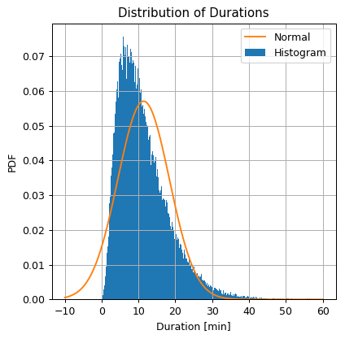
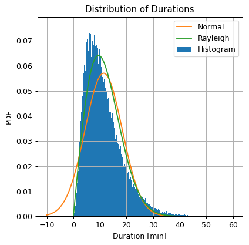
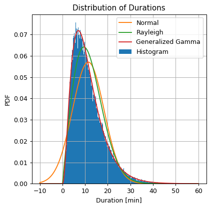
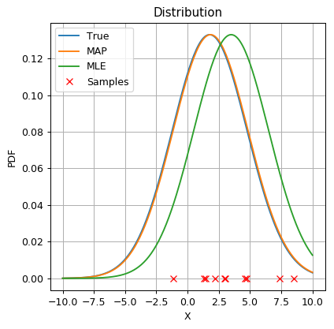
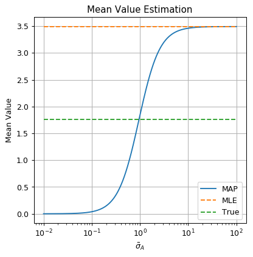

<!-- .slide: class="center" -->

<h1 class="workshop-title">Workshop 3<br>MLE, MAP & Estimation Errors</h1>

---new slide---

##  Still with The NYC Taxi Dataset 

Let us return to the taxi rides [dataset](https://technion046195.github.io/semester_2019_spring/datasets/nyc_taxi_rides.csv) from the last workshop.

<br>

###  Problem Reminder: Estimating the Distribution of Trip Duration

Estimate the distribution of taxi rides duration using parametric models.

---new slide---

##  Model & Learning Method Suggestion 1 : Normal Distribution + MLE

<br>
### Model
- **normal distribution**
- Is define by 2 parameters: `$\mu$` and `$\sigma$`.

<br>

### Learninig method
- **MLE (Maximum Likelihood Estimation)**

<br>

*This special case of MLE and a normal distribution can be solve analytically.*

---new slide---

##  Learning

###  Exercise 3.1 - MLE + Normal Distribution

#### Question 3.3-1

<br>

Use the MLE approach to estimate the PDF of rides duration as a normal distribution.

---new slide---

#### Solution 3.3-1

<br>

As seen in the lectures:

`$$
\mu=\displaystyle{\frac{1}{N}\sum_i x_i} \\
\sigma=\sqrt{\displaystyle{\frac{1}{N}\sum_i\left(x_i-\mu\right)^2}} \\
$$`

---new slide---

#### Solution 3.3-1 Cont.

<br>

```python
## Normal distribution parameters
mu = np.sum(x) / len(x)
sigma = np.sqrt(np.sum((x - mu) ** 2) / len(x))
```

<br>

`$\mu = 11.4\ \text{min}$`

`$\sigma = 7.0\ \text{min}$`

<br>

- From here on we will use [np.mean](http://lagrange.univ-lyon1.fr/docs/numpy/1.11.0/reference/generated/numpy.mean.html) and [np.std](http://lagrange.univ-lyon1.fr/docs/numpy/1.11.0/reference/generated/numpy.std.html).

- We will also use [scipy.stats](https://docs.scipy.org/doc/scipy/reference/stats.html) which can calculate the CDF and PDF, performe MLE fit, generate samples and more, for known distributions.

---new slide---

#### Question 3.3-2

<br>

Plot the estimated PDF on top of an histogram of the rides duration.

#### Solution 3.1-2

<center><div style="display:inline-block;background-color:rgba(255, 255, 255, 0.7); box-shadow: 0 0 5px 10px rgba(255, 255, 255, 0.7)">

</div></center>

---new slide---

#### Question 3.3-3

By looking at the two plots, do you thinks that the Gaussian distribution is a good approximation for the data distribution?

---new slide---

#### Solution 3.1-3

<center><div style="display:inline-block;background-color:rgba(255, 255, 255, 0.7); box-shadow: 0 0 5px 10px rgba(255, 255, 255, 0.7)">

</div></center>

- A very rough approximation of the real distribution.

- In some cases this would be good enough

- non zero probability to get negative ride durations.

- We would like to do better.

---new slide---

## The Rayleigh Distribution

<br>

For a 2D random Gaussian vector with zero mean and no cross correlation:

`$$
\boldsymbol{Z}\sim N\left(\begin{bmatrix} 0 \\ 0 \end{bmatrix}, \begin{bmatrix} \sigma & 0 \\ 0 & \sigma \end{bmatrix}\right)
$$`

<br>

The magnitude `$\left\lVert\boldsymbol{Z}\right\rVert_2=\sqrt{Z_x^2+Z_y^2}$` has a Rayleigh distribution.

---new slide---

## The Rayleigh Distribution - Cont.

<br>

Rayleigh Distribution's PDF:

`$$
p_\text{Rayleigh}\left(z;\sigma\right)=\frac{z}{\sigma^2}\exp\left({-\frac{z^2}{2\sigma^2}}\right), \quad z\geq0
$$`

<br>

- Defined only for positive values.

- One parameter `$\sigma$` (which is not equal to the standard deviation).

- We will denote `$\boldsymbol{\theta}=\left[\sigma\right]$`

---new slide---

##  Model & Learning Method Suggestion 2 : Rayleigh Distribution + MLE

<br>
### Model
- **normal distribution**
- Is define by 2 parameters: `$\mu$` and `$\sigma$`.

<br>

### Learninig method
- **MLE (Maximum Likelihood Estimation)**
- This case as well can be solve analytically.

---new slide---

##  Learning

###  Exercise 3.2 - MLE + Rayleigh Distribution

<br>

Repeat the process using the Rayleigh distribution.

---new slide---

### Solution 3.2

<br>

Under the MLE approach, we would like to find:

<br>

`$$
\boldsymbol{\theta}^*=\underset{\boldsymbol{\theta}}{\arg\min}\ -l_\text{rayleigh}\left(\boldsymbol{\theta};\{x\}\right)
$$`.

---new slide---

### Solution 3.2 - Cont.

Or be using SciPy:

<br>

```python
## Import the normal distribution model from SciPy
from scipy.stats import rayleigh

## Find the model's parameters using SciPy
_, sigma = rayleigh.fit(x, floc=0)  ## equivalent to running: sigma = np.sqrt(np.sum(x ** 2) / len(x) / 2)

print_math('$\\sigma = {:.01f}$'.format(sigma))

## Define the Rayleigh distribution object
rayleigh_dist = rayleigh(0, sigma)

## Calculate the Rayleigh distribution PDF over the grid
rayleigh_pdf = rayleigh_dist.pdf(grid)

```

<br>

`$\sigma = 9.5$`

---new slide---

### Solution 3.2 - Cont. 2

<center><div style="display:inline-block;background-color:rgba(255, 255, 255, 0.7); box-shadow: 0 0 5px 10px rgba(255, 255, 255, 0.7)">

</div></center>

- Does a slightly better job at approximating the distribution

- Solves the negative values problem.

Let us try one more model.

---new slide---

## The Generalized Gamma Distribution

<br>

The PDF of the distribution is:

`$$
p_\text{gengamma}\left(z;\sigma,a,c\right)=
\frac{cz^{ca-1}\exp\left(-\left(z/\sigma\right)^c\right)}{\sigma^{ca-1}\Gamma\left(a\right)}
, \quad z\geq0
$$`

*For $c=2$ and $a=1$ we get the Rayleigh distribution.*

<br>
<br>

- No analytic solution.
- We will use numerical methods.

---new slide---

##  Model & Learning Method Suggestion 2 : Generalized Gamma Distribution + MLE

<br>
### Model
- **generalized gamma distribution**
- Is define by 3 parameters: `$\sigma$`, a and c.

<br>

### Learninig method
- **MLE (Maximum Likelihood Estimation)**
- Will be solved numerically.

---new slide---

##  Learning

###  Exercise 3.3 - MLE + Gen. Gamma Distribution

<br>

Repeat the process using the Generalized Gamma distribution.

---new slide---

### Solution 3.3

<br>

```python
## Import the normal distribution model from SciPy
from scipy.stats import gengamma

## Find the model's parameters using SciPy
a, c, _, sigma  = gengamma.fit(x, floc=0)

print_math('$a = {:.01f}$'.format(a))
print_math('$c = {:.01f}$'.format(c))
print_math('$\\sigma = {:.01f}$'.format(sigma))

## Define the generalized gamma distribution object
gengamma_dist = gengamma(a, c, 0, sigma)

## Calculate the generalized gamma distribution PDF over the grid
gengamma_pdf = gengamma_dist.pdf(grid)
```

`$a = 4.4$`

`$c = 0.8$`

`$\sigma = 1.6$`

---new slide---

### Solution 3.2 - Cont. 2

<center><div style="display:inline-block;background-color:rgba(255, 255, 255, 0.7); box-shadow: 0 0 5px 10px rgba(255, 255, 255, 0.7)">

</div></center>

- Much more similar to the shape of the histogram.

---new slide---

##  Exercise 3.4 - MAP and a Toy Model

Consider the following process:

1. $a$ is generated once: `$a \sim N\left(0, \sigma_A^2\right)$`

2. `$\left\{x_i\right\}$` are generated independently: `$X \sim N\left(a, \sigma_X^2\right)$`

<br>
<br>

Questions:

1. Using the exact model and the  MAP approach to estimated the distribution of $X$ given a dataset `$\left\{x_i\right\}$`.

---new slide---

### Solution 3.3-1

<br>

Following the MAP approach we would like to find `$\boldsymbol{\theta}^*=\left[a^*\right]$`. such that:

`$$
\boldsymbol{\theta}^* = \underset{\boldsymbol{\theta}}{\arg\max}\ p\left(\left\{x_i\right\}|\boldsymbol{\theta}\right)p\left(\boldsymbol{\theta}\right)
$$`

<br>

As seen in the recitation:

`$$
a^* = \frac{1}{\frac{\sigma_X^2 / N}{\sigma_A^2}+1}\frac{1}{N}\sum_i x_i
$$`

---new slide---

### Question 3.3-2

<br>

- Use `$\sigma_A=1$ and $\sigma_X=3$` to randomly generate the dataset of 10 samples. 

- Estimate the MAP parameters

- Calculate the error between the true and estimated parameters.

---new slide---

### Solution 3.3-2

```python
n_samples = 10
sigma_x = 3
sigma_a = 1

## Generate a random generator with a fixed seed
rand_gen = np.random.RandomState(0)

## Draw a random value for a
a = rand_gen.randn() * sigma_a

## Draw N random samples for {x_i}
x = rand_gen.randn(n_samples) * sigma_x + a

## Calaulte the MAP estimation for the mean value
mu_hat_map = sigma_a ** 2 / (sigma_x ** 2 / n_samples + sigma_a ** 2) * np.mean(x)

## Calaulte the estimation error
estimation_error_map = np.abs(mu_hat_map-a)
```

---new slide---

### Solution 3.3-2 - Cont.

<br>

The true mean value of `$X$ is: $\mu=a = 1.764$`

By using MAP we get:

- `$\hat{\mu}_\text{MAP} = 1.838$`

- Estimation error: `$\left|\hat{\mu}_\text{MAP}-\mu\right| = 0.074$`

---new slide---

### Question 3.3-3

<br>

Compare it to an estimation based on MLE.

---new slide---

### Solution 3.3-3

<br>

We saw earlier for MLE: `$\hat\mu_\text{MLE}=\frac{1}{N}\sum_i x_i$`

```python
## Calaulte the MLE estimation for the mean value
mu_hat_mle = x.mean()

## Calaulte the estimation error
estimation_error_mle = np.abs(mu_hat_mle-a)
```

<br>

By using MLE we get:

- `$\hat{\mu}_\text{MLE} = 3.492$`

- Estimation error: `$\left|\hat{\mu}_\text{MLE}-\mu\right| = 1.728$`

---new slide---

### Solution 3.3-3 - Cont.

<br>

<center><div style="display:inline-block;background-color:rgba(255, 255, 255, 0.7); box-shadow: 0 0 5px 10px rgba(255, 255, 255, 0.7)">

</div></center>

---new slide---

### Question 3.3-4

<br>

- MAP works great when we have a good prior distribution.

- Repeat the process using `$\tilde{\sigma}_A=\left[0.25, 0.5, 2, 4\right]$`.

---new slide---

### Solution 3.3-4

<br>

```python
## Define the list of sigma_a_tilde
sigma_a_tilde_list = [0.25, 0.5, 1, 2, 4]

print_math('By using MAP with different values of $\\tilde{{\\sigma}}_A$ we get:')
for i, sigma_a_tilde in enumerate(sigma_a_tilde_list):
    ## Calaulte the MLE estimation for the mean value
    mu_hat_map_tilde = sigma_a_tilde ** 2 / (sigma_x ** 2 / n_samples + sigma_a_tilde ** 2) * np.mean(x)
    
    ## Calaulte the estimation error
    estimation_error_map_tilde = np.abs(mu_hat_map_tilde-a)
```

---new slide---

### Solution 3.3-4 - Cont.

<br>

By using MAP with different values of `$\tilde{{\sigma}}_A$` we get:

- `$\tilde{\sigma}_A=0.25\quad\Rightarrow\hat{\mu} = 0.227,\quad\left|\hat{\mu}-\mu\right| = 1.537$`

- `$\tilde{\sigma}_A=0.50\quad\Rightarrow\hat{\mu} = 0.759,\quad\left|\hat{\mu}-\mu\right| = 1.005$`

- `$\tilde{\sigma}_A=1.00\quad\Rightarrow\hat{\mu} = 1.838,\quad\left|\hat{\mu}-\mu\right| = 0.074$`

- `$\tilde{\sigma}_A=2.00\quad\Rightarrow\hat{\mu} = 2.851,\quad\left|\hat{\mu}-\mu\right| = 1.087$`

- `$\tilde{\sigma}_A=4.00\quad\Rightarrow\hat{\mu} = 3.306,\quad\left|\hat{\mu}-\mu\right| = 1.542$`

---new slide---

### Solution 3.3-4 - Cont. 2

<br>

<center><div style="display:inline-block;background-color:rgba(255, 255, 255, 0.7); box-shadow: 0 0 5px 10px rgba(255, 255, 255, 0.7)">

</div></center>

---new slide---

### Interpretation

- Normal distributions results in a weighted average between MLE and the prior.

- The best results when our prior is the exact true distribution.

- Very strong prior / narrow Gaussian -> an estimation which is very close to 0.

- Very wea prior / wide Gaussian -> the MAP estimation approaches the MLE.

- It is hard to choose a good prior