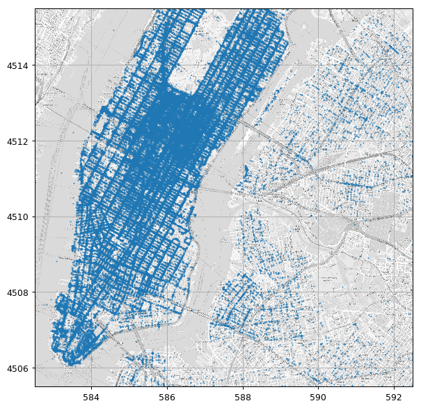
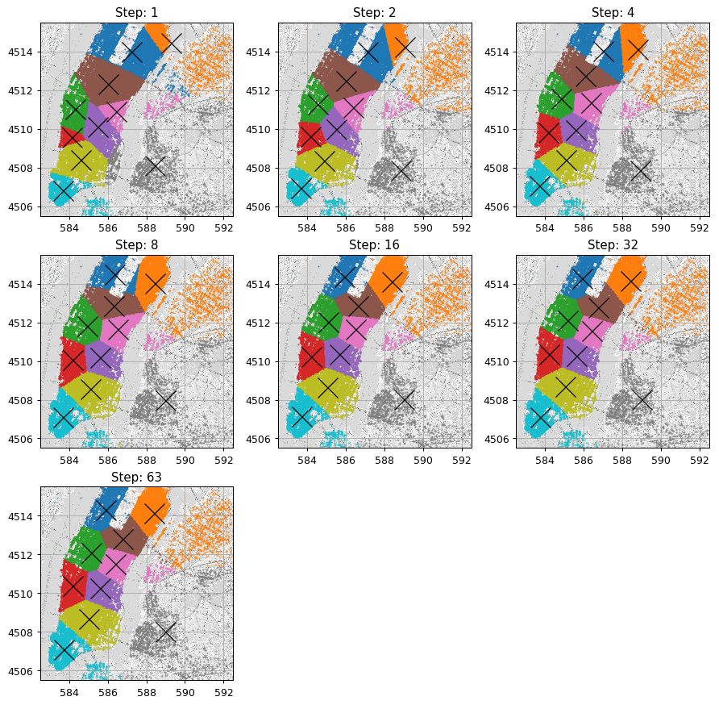
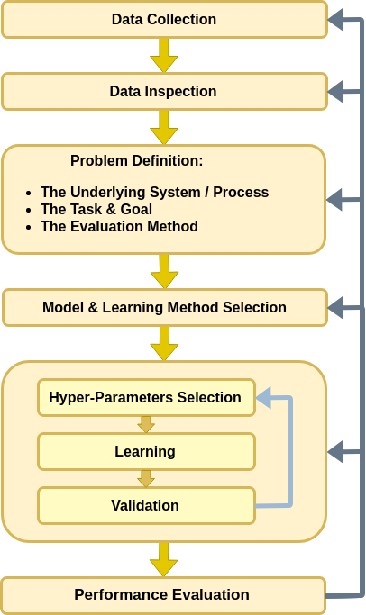
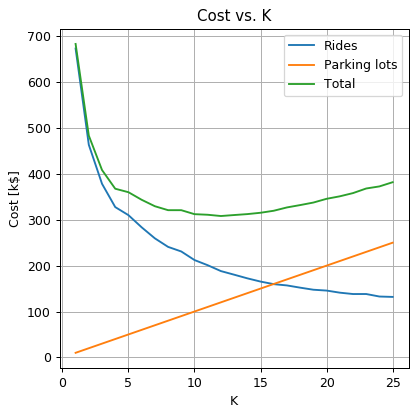

<!-- .slide: class="center" -->

<h1 class="workshop-title">Workshop 4<br>K-Means</h1>

---new slide---

## Examples of Different Clustering Algorithms

<center>

</center>

---new slide---

##  Still with The NYC Taxi Dataset 

<div>
<table border="1" class="dataframe">
  <thead>
    <tr style="text-align: right;">
      <th></th>
      <th>passenger_count</th>
      <th>trip_distance</th>
      <th>payment_type</th>
      <th>fare_amount</th>
      <th>tip_amount</th>
      <th>pickup_easting</th>
      <th>pickup_northing</th>
      <th>dropoff_easting</th>
      <th>dropoff_northing</th>
      <th>duration</th>
      <th>day_of_week</th>
      <th>day_of_month</th>
      <th>time_of_day</th>
    </tr>
  </thead>
  <tbody>
    <tr>
      <th>0</th>
      <td>2</td>
      <td>2.768065</td>
      <td>2</td>
      <td>9.5</td>
      <td>0.00</td>
      <td>586.996941</td>
      <td>4512.979705</td>
      <td>588.155118</td>
      <td>4515.180889</td>
      <td>11.516667</td>
      <td>3</td>
      <td>13</td>
      <td>12.801944</td>
    </tr>
    <tr>
      <th>1</th>
      <td>1</td>
      <td>3.218680</td>
      <td>2</td>
      <td>10.0</td>
      <td>0.00</td>
      <td>587.151523</td>
      <td>4512.923924</td>
      <td>584.850489</td>
      <td>4512.632082</td>
      <td>12.666667</td>
      <td>6</td>
      <td>16</td>
      <td>20.961389</td>
    </tr>
    <tr>
      <th>2</th>
      <td>1</td>
      <td>2.574944</td>
      <td>1</td>
      <td>7.0</td>
      <td>2.49</td>
      <td>587.005357</td>
      <td>4513.359700</td>
      <td>585.434188</td>
      <td>4513.174964</td>
      <td>5.516667</td>
      <td>0</td>
      <td>31</td>
      <td>20.412778</td>
    </tr>
    <tr>
      <th>3</th>
      <td>1</td>
      <td>0.965604</td>
      <td>1</td>
      <td>7.5</td>
      <td>1.65</td>
      <td>586.648975</td>
      <td>4511.729212</td>
      <td>586.671530</td>
      <td>4512.554065</td>
      <td>9.883333</td>
      <td>1</td>
      <td>25</td>
      <td>13.031389</td>
    </tr>
    <tr>
      <th>4</th>
      <td>1</td>
      <td>2.462290</td>
      <td>1</td>
      <td>7.5</td>
      <td>1.66</td>
      <td>586.967178</td>
      <td>4511.894301</td>
      <td>585.262474</td>
      <td>4511.755477</td>
      <td>8.683333</td>
      <td>2</td>
      <td>5</td>
      <td>7.703333</td>
    </tr>
    <tr>
      <th>5</th>
      <td>5</td>
      <td>1.561060</td>
      <td>1</td>
      <td>7.5</td>
      <td>2.20</td>
      <td>585.926415</td>
      <td>4512.880385</td>
      <td>585.168973</td>
      <td>4511.540103</td>
      <td>9.433333</td>
      <td>3</td>
      <td>20</td>
      <td>20.667222</td>
    </tr>
    <tr>
      <th>6</th>
      <td>1</td>
      <td>2.574944</td>
      <td>1</td>
      <td>8.0</td>
      <td>1.00</td>
      <td>586.731409</td>
      <td>4515.084445</td>
      <td>588.710175</td>
      <td>4514.209184</td>
      <td>7.950000</td>
      <td>5</td>
      <td>8</td>
      <td>23.841944</td>
    </tr>
    <tr>
      <th>7</th>
      <td>1</td>
      <td>0.804670</td>
      <td>2</td>
      <td>5.0</td>
      <td>0.00</td>
      <td>585.344614</td>
      <td>4509.712541</td>
      <td>585.843967</td>
      <td>4509.545089</td>
      <td>4.950000</td>
      <td>5</td>
      <td>29</td>
      <td>15.831389</td>
    </tr>
    <tr>
      <th>8</th>
      <td>1</td>
      <td>3.653202</td>
      <td>1</td>
      <td>10.0</td>
      <td>1.10</td>
      <td>585.422062</td>
      <td>4509.477536</td>
      <td>583.671081</td>
      <td>4507.735573</td>
      <td>11.066667</td>
      <td>5</td>
      <td>8</td>
      <td>2.098333</td>
    </tr>
    <tr>
      <th>9</th>
      <td>6</td>
      <td>1.625433</td>
      <td>1</td>
      <td>5.5</td>
      <td>1.36</td>
      <td>587.875433</td>
      <td>4514.931073</td>
      <td>587.701248</td>
      <td>4513.709691</td>
      <td>4.216667</td>
      <td>3</td>
      <td>13</td>
      <td>21.783056</td>
    </tr>
  </tbody>
</table>
</div>

<br>

This time we will be looking at the following two columns:

**dropoff_easting** - The horizontal coordinate.

**dropoff_northing** - The vertical coordinate.

---new slide---

##  Problem: Finding The Optimal Parking Lots Locations

<br>

- A taxi company is looking to rent `$K$` parking lots

<br>

- Select the optimal locations for minimal average distance from the drop off to parking lot.

---new slide---

##    The workflow

<center>

</center>

---new slide---

### Plotting Drop Off  Points

<center><div style="display:inline-block;background-color:rgba(255, 255, 255, 0.7); box-shadow: 0 0 5px 10px rgba(255, 255, 255, 0.7)">

</div></center>

---new slide---

##  Problem Definition

<br>

### The underlying process

<br>

A random phenomenon generating taxi rides.

<br>

### The task and goal

<br>

Find $K$ parking lots to minimize distance to the nearest parking lot.

---new slide---

##  Problem Definition - Cont.

<br>

### Evaluation method

- `$X$` The drop off location.
- `$\boldsymbol{c}_i$`: The location of the `$i$`-th parking lot.
- `$N$`: The number of points in the dataset.

We would like to define and minimize the following risk function:

<br>

`$$
R\left(\left\{\boldsymbol{c}_i\right\}\right)=\mathbb{E}\left[\min_{\boldsymbol{c}\in\left\{\boldsymbol{c}_i\right\}}\left\lVert\boldsymbol{x}-\boldsymbol{c}\right\rVert\right]
$$`

---new slide---

##  Problem Definition - Cont. 2

Empirical risk:

`$$
\hat{R}\left(\left\{\boldsymbol{c}_i\right\}\right)=\frac{1}{N}\sum_{\boldsymbol{x}_j}\min_{\boldsymbol{c}\in\left\{\boldsymbol{c}\right\}}\left\lVert\boldsymbol{x}_j-\boldsymbol{c}\right\rVert
$$`

<br>

Or as a clustering problem:

`$S_{i}$` - the cluster of points closest with $c_i$ as the closet parking lot:

`$$
\hat{R}\left(\left\{\boldsymbol{c}_i\right\}\right)=\frac{1}{N}\sum_{i=1}^K\sum_{\boldsymbol{x}_j\in S_i}\left\lVert\boldsymbol{x}_j-\boldsymbol{c}_i\right\rVert
$$`

---new slide---

### Splitting the dataset

We will split the data into 80% train set and 20% test set.

```python
n_samples = len(dataset)

## Generate a random generator with a fixed seed
rand_gen = np.random.RandomState(0)

## Generating a vector of indices
indices = np.arange(n_samples)

## Shuffle the indices
rand_gen.shuffle(indices)

## Split the indices into 80% train / 20% test
n_samples_train = int(n_samples * 0.8)
n_samples_test = n_samples - n_samples_train
train_indices = indices[:n_samples_train]
test_indices = indices[n_samples_train:]

train_set = dataset.iloc[train_indices]
test_set = dataset.iloc[test_indices]
```

---new slide---

##  Model & Learning Method Suggestion

### Model

- All possible selections of $K$ 2D points.

<br>

### Learning Method: K-Means

- K-means does not solve our problem.
- It minimizes the **squared** Euclidean distance.

- No efficient solution for solving our exact problem.

This is a common case: We do not have an efficient solution -> we solve a similar problem.

---new slide---

##  Learning

###  Exercise 4.1 - K-Means

<br>
1. Use the data and k-means to select the location of 10 parking lots

2. Evaluate the empirical risk on the train set

---new slide---

#### Solution 4.1-1

<br>
<br>

```python
from scipy.spatial import distance  # A function for efficiently calculating all the distances between points in two lists of points.

## Set K
k = 10

## Define x (the matrix of the drop off locations)
x = train_set[['dropoff_easting', 'dropoff_northing']].values
n_samples = len(x)

## Create a random generator using a fixed seed (we fix the seed for reproducible results)
rand_gen = np.random.RandomState(0)

```

---new slide---

#### Solution 4.1-1 - Cont.

<br>

```python
## Initialize the means using k random points from the dataset
means = x[rand_gen.randint(low=0, high=n_samples, size=k)]
assignment = np.zeros(n_samples, dtype=int)

stop_iterations = False
while not stop_iterations:
    i_step += 1
    assignment_old = assignment

    ## Step 1: Assign point to means
    distances = distance.cdist(x, means, 'euclidean')
    assignment = np.argmin(distances, axis=1)

    ## Stop criteria
    if (assignment == assignment_old).all():
        stop_iterations = True

    ## Step 2: Update means
    for i_cluster in range(k):
        cluster_indices = assignment == i_cluster
        means[i_cluster] = x[cluster_indices].mean(axis=0)

parking_lots_locations = means
```

---new slide---

#### Solution 4.1-1 - Cont.2

<center><div style="display:inline-block;background-color:rgba(255, 255, 255, 0.7); box-shadow: 0 0 5px 10px rgba(255, 255, 255, 0.7)">

</div></center>

---new slide---

#### Solution 4.1-1 - Cont.3

<br>
<br>

From here on we will use the [sklearn.cluster.KMeans](https://scikit-learn.org/stable/modules/generated/sklearn.cluster.KMeans.html).

---new slide---

#### Solution 4.1-2

<br>

Empirical risk on the train set:

`$$
\hat{R}\left(\left\{\boldsymbol{c}_i\right\}\right)=\frac{1}{N}\sum_{\boldsymbol{x}_j}\min_{\boldsymbol{c}\in\left\{\boldsymbol{c}\right\}}\left\lVert\boldsymbol{x}_j-\boldsymbol{c}\right\rVert
$$`

---new slide---

#### Solution 4.1-2 - Cont.

<br>

```python
## Calculate distances to all parking lots
distances = distance.cdist(x, parking_lots_locations, 'euclidean')

## Calculate the average of the distances to the colsest parking lot to each point
train_risk = distances.min(axis=1).mean()

print('The average ride distance to the closest parking lots is approximately {:.02f} km'.format(train_risk))
```

<br>

The average ride distance to the closest parking lots is approximately 0.70 km

---new slide---

##  Performance Evaluation

###  Exercise 4.2

#### Question 4.2-1

Evaluate the performance.

<br>

#### Solution 4.2-1

The average ride distance to the closest parking lots is approximatley 0.70 km

---new slide---

#### Question 4.2-(2 & 3)

- Name 2 reasons why this solution is not optimal.

- Suggest methods to improve.

<br>

#### Solution 4.2-(2 & 3)

1. K-means converges to a local minimum -> run the K-means algorithm several times.

2. K-means minimizes squared distances -> find the point which minimizes the sum of distances in each cluster.

<br>

**A side note**: *The Geometric Median* ([wiki](https://en.wikipedia.org/wiki/Geometric_median)) can be found using *Weiszfeld's algorithm*.

---new slide---

##  Problem 2: Finding The Optimal Number of Parking Lots

Selecting the number of parking lots.

Let us assume that:

1. The price of operating a parking lot is 10k\\$ per month.

2. There will be exactly 100k rides to the parking lots per month.

3. Price per kilometer driving to the parking is 3$ / kilometer.

---new slide---

##  Problem Definition

###  Exercise 4.3

Write a risk function which is the expected mean total cost.

<br>

#### Solution 4.3

The risk function would be:

`$$
R\left(\left\{\boldsymbol{c}_i\right\}, K\right)= 10\cdot K+100\cdot3\cdot\mathbb{E}\left[\min_{\boldsymbol{c}\in\left\{\boldsymbol{c}_i\right\}}\left\lVert\boldsymbol{x}-\boldsymbol{c}\right\rVert\right]
$$`

---new slide---

#### Solution 4.3 - Cont.

<br>

The empirical risk function would be:

`$$
\hat{R}\left(\left\{\boldsymbol{c}_i\right\}, K\right)= 10\cdot K+300\cdot\frac{1}{N}\sum_{i=1}^K\sum_{\boldsymbol{x}_j\in S_i}\left\lVert\boldsymbol{x}_j-\boldsymbol{c}_i\right\rVert
$$`

---new slide---

##  Model & Learning Method Suggestion

### Model

- Space of any number of parking lots with any possible locations.
 
- We can run over all relevant values of $K$ to find the optimal value.

<br>

**hyper-parameters** : The part of the model which we do not have an efficient way to select.

---new slide---

##  Model & Learning Method Suggestion - Cont.

Two more hyper-parameters which we have encountered so far are:

- The number of bins in a histogram.

- The kernel and width in KDE.

<br>

Two approaches for selecting the hyper-parameters values are:

- Brute Force / Grid Search

- Trial and error

---new slide---

## The workflow revisited - Hyper-parameters

Let us add the loop/iterations over the hyper-parameters to our workflow

<center>

</center>

---new slide---

##  Learning

<br>

###  Exercise 4.4

- Use K-means to select the number and locations of parking lots.

- Search over the range of $1\leq K \leq 25$.

- Plot the empirical train risk as a function of $K$.

---new slide---

#### Solution 4.4

```python
## import KMeans from scikit-learn
from sklearn.cluster import KMeans

cost_per_parking = 10
cost_per_avarage_distance = 300

## Define the grid of K's over we will search for our solution
k_grid = np.arange(1, 26, 1)

## Create a random generator using a fixed seed 
rand_gen = np.random.RandomState(0)

```

---new slide---

#### Solution 4.4 - Cont

```python
best_risk_so_far = np.inf
optimal_k = None
optimal_average_distance = None
optimal_centers = None
for i_k, k in enumerate(tqdm.tqdm_notebook(k_grid)):

    ## Calculate ceneters and clusters
    kmeans = KMeans(n_clusters=k, random_state=rand_gen)
    assignments = kmeans.fit_predict(x)
    centers = kmeans.cluster_centers_

    ## Evaluate the empirical risk
    distances = np.linalg.norm(x - centers[assignments], axis=1)
    average_distance = distances.mean()
    risk = cost_per_parking * k + cost_per_avarage_distance * average_distance

    ## If this is the best risk so far save the optimal results
    if risk < best_risk_so_far:
        best_risk_so_far = risk
        optimal_k = k
        optimal_average_distance = average_distance
        optimal_centers = centers
```

---new slide---

#### Solution 4.4 - Cont. 2

The optimal number of parking lots is: 12

The optimal average ride distance is: 0.63 Km

The train risk is 308.12 k$


<center><div style="display:inline-block;background-color:rgba(255, 255, 255, 0.7); box-shadow: 0 0 5px 10px rgba(255, 255, 255, 0.7)">

</div></center>

---new slide---

##  Performance evaluation

```python
## Calculate distances to all parking lots
distances = distance.cdist(x_test, optimal_centers, 'euclidean')

## Calculate the average distance and risk
test_average_distance = distances.min(axis=1).mean()
test_risk = cost_per_parking * optimal_k + cost_per_avarage_distance * test_average_distance

print('The optimal average ride distance is: {:.2f} Km'.format(test_average_distance))
print('The train risk is {:.2f} k$'.format(test_risk))
```

<br>

The optimal average ride distance is: 0.63 Km

The train risk is 307.81 k$

---new slide---

## Train-Validation-Test Separation

- We have selected $K$ based upon the train set. 

- Problematic since the risk would be too optimistic due to overfitting.

- Mainly problematic in case of small amount of data.

<br>

#### The solution

<br>

Divide the dataset once more.

A common practice: 60% train - 20% validation - 20% test.

---new slide---

###  Exercise 4.4

<br>

- Repeat the learning process using the 3-fold split.

- Did the results change significantly? Why?

---new slide---

#### Solution 4.4

We shall start by splitting the data


```python
## Generate a random generator with a fixed seed
rand_gen = np.random.RandomState(0)

## Generating a vector of indices
indices = np.arange(n_samples)

## Shuffle the indices
rand_gen.shuffle(indices)

## Split the indices into 80% train / 20% test
n_samples_train = int(n_samples * 0.6)
n_samples_validation = int(n_samples * 0.2)
n_samples_test = n_samples - n_samples_train
train_indices = indices[:n_samples_train]
validation_indices = indices[:n_samples_train]
test_indices = indices[n_samples_train:]

train_set = dataset.iloc[train_indices]
validation_set = dataset.iloc[validation_indices]
test_set = dataset.iloc[test_indices]
```

---new slide---

#### Solution 4.4 - Cont.

The optimal number of parking lots is: 12

The optimal average ride distance is: 0.63 Km

The train risk is 307.81 k$


<center><div style="display:inline-block;background-color:rgba(255, 255, 255, 0.7); box-shadow: 0 0 5px 10px rgba(255, 255, 255, 0.7)">

</div></center>

---new slide---

#### Solution 4.4 - Cont. 2

<br>

- Same as without the validation-split: the optimal $K$ is 12.

- The amount of data is large -> the overfit seems to be small.

- In general, hard to tell if our dataset is large enough, and how much overfit we have.